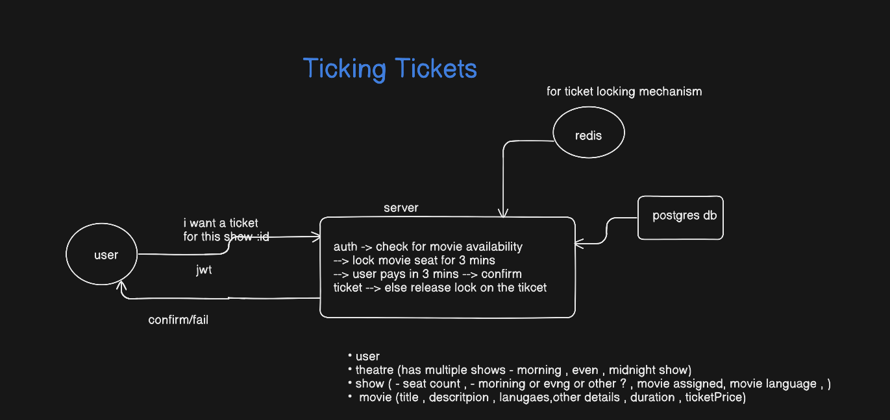
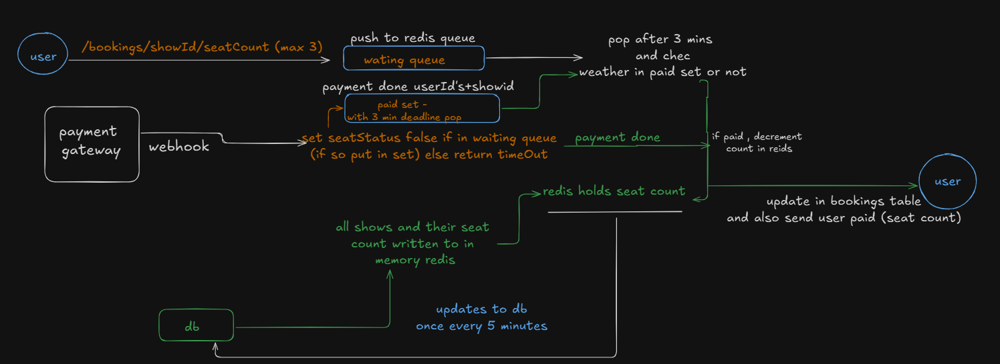

# 🎬 Ticking Tickets

> A real-time movie ticket booking backend with seat locking, queue-based payments, and WebSocket notifications — deployed on AWS EC2 with Docker & Nginx.


---

## 🏗️ Architecture



### Booking Flow (Seat Locking + Payment)



> 📊 Database schema details available in [`backend/src/db/init.ts`](backend/src/db/init.ts)
>
> 📐 More architecture diagrams available in [`architectures/`](architectures/)

### 🔌 WebSocket Flow (Real-time Seat Updates)

The WebSocket layer powers **real-time seat updates** across all connected clients. It uses a **ticket-based authentication** system (not raw JWTs) to prevent token leakage in WebSocket URLs.

```
1. Client calls GET /api/v1/auth/ticket  →  receives one-time ticket (stored in Redis, 30s TTL)
2. Client opens WebSocket: ws://localhost:4000/ws
3. Client sends { event: "auth", data: { ticket: "<ticket>" } }
4. Server validates & consumes ticket (single-use)  →  sends auth-success
5. Client sends { event: "join-show", data: { showId: "1" } }
6. Server adds client to show room  →  streams seat-state events
```

#### Client → Server Events

| Event | Payload | Description | Requires Auth |
|-------|---------|-------------|---------------|
| `auth` | `{ ticket: "<ticket>" }` | Authenticate using one-time ticket | ❌ (first step) |
| `join-show` | `{ showId: "1" }` | Subscribe to a show's seat updates | ✅ |
| `leave-show` | `{ showId: "1" }` | Unsubscribe from a show room | ✅ |

#### Server → Client Events

| Event | Payload | When |
|-------|---------|------|
| `auth-success` | `{ userId }` | After valid ticket authentication |
| `auth-error` | `{ message }` | Invalid/expired ticket |
| `seat-state` | `{ showId, available: [], locked: [] }` | On join + every seat change (debounced 100ms) |
| `your-locked-seats` | `{ seats: [5, 6] }` | Session recovery — sent on join if user has active locks |
| `show-closed` | `{ showId, message }` | Admin stops booking — all clients ejected |
| `error` | `{ message }` | Unauthenticated action or show not live |

#### Why Ticket Auth? (Not Raw JWT)

> WebSocket connections can't send HTTP headers. Passing JWTs in query params (`?token=xxx`) exposes them in server logs, browser history, and proxies. Instead, we:
> 1. Issue a **short-lived, one-time-use ticket** via the REST API (stored in Redis with 30s TTL)
> 2. Client sends it over the **already-encrypted WebSocket connection**
> 3. Server **validates and deletes** the ticket (can't be replayed)

#### Room Management

- **Rooms are created** when admin calls `POST /shows/:id/go-live`
- **Rooms are destroyed** when admin calls `POST /shows/:id/stop-booking` (all clients receive `show-closed` and are disconnected)
- **Debounced broadcasts** — seat-state updates are batched at 100ms to prevent flooding during high-traffic booking bursts
- **Auto-cleanup** — when a client disconnects, they are removed from all subscribed rooms

---

## ✨ Features

- **JWT Authentication** — Secure signup/login for Users and Admins
- **Real-time Seat Locking** — Redis-based locks with automatic expiry (prevents double-booking)
- **Queue-based Payments** — BullMQ workers handle payment timeouts and seat release
- **WebSocket Notifications** — Ticket-based WebSocket auth for live seat updates
- **Admin Panel API** — Full CRUD for Movies, Shows, and Theatres
- **Search API** — Filter shows by movie, language, and availability
- **Razorpay Integration** — Payment gateway with webhook verification
- **Dockerized** — One-command deployment with `docker compose`
- **Nginx Reverse Proxy** — Load balanced and reverse proxy with Nginx hosted on EC2 
- **AWS EC2 Hosted** — Deployed on Ubuntu with Docker Compose

---

## 🛠️ Tech Stack

| Layer | Technology |
|-------|-----------|
| **Runtime** | Node.js (v20) + TypeScript |
| **Framework** | Express v5 |
| **Database** | PostgreSQL 15 |
| **Cache / Locks** | Redis 7 |
| **Queue** | BullMQ (Redis-backed) |
| **Auth** | JWT + bcrypt |
| **Payments** | Razorpay |
| **WebSockets** | ws (native) |
| **Containerization** | Docker + Docker Compose |
| **Reverse Proxy** | Nginx |
| **Cloud** | AWS EC2 (Ubuntu) |
| **Testing** | Jest + Supertest |

---

## 📡 API Reference

### Auth (`/api/v1/auth`)

| Method | Endpoint | Description | Auth |
|--------|----------|-------------|------|
| `POST` | `/signup` | Register a new user | ❌ |
| `POST` | `/login` | Login (returns JWT) | ❌ |
| `POST` | `/admin/login` | Admin login | ❌ |
| `GET` | `/ticket` | Get WebSocket ticket | 🔐 User |

### Admin (`/api/v1/admin`)

| Method | Endpoint | Description | Auth |
|--------|----------|-------------|------|
| `POST` | `/movies` | Create a movie | 🔐 Admin |
| `PUT` | `/movies/:id` | Update a movie | 🔐 Admin |
| `DELETE` | `/movies/:id` | Delete a movie | 🔐 Admin |
| `POST` | `/shows` | Create a show | 🔐 Admin |
| `PUT` | `/shows/:id` | Update a show | 🔐 Admin |
| `DELETE` | `/shows/:id` | Delete a show | 🔐 Admin |
| `POST` | `/shows/:id/go-live` | Open booking for a show | 🔐 Admin |
| `POST` | `/shows/:id/stop-booking` | Close booking | 🔐 Admin |
| `POST` | `/theatres` | Create a theatre | 🔐 Admin |
| `PUT` | `/theatres/:id` | Update a theatre | 🔐 Admin |
| `DELETE` | `/theatres/:id` | Delete a theatre | 🔐 Admin |

### Search (`/api/v1/search`)

| Method | Endpoint | Description | Auth |
|--------|----------|-------------|------|
| `GET` | `/?q=<query>` | Search shows/movies | ❌ |

### Bookings (`/api/v1/bookings`)

| Method | Endpoint | Description | Auth |
|--------|----------|-------------|------|
| `POST` | `/:showId/lock` | Lock seats (body: `{ seats: [1,2] }`) | 🔐 User |
| `POST` | `/:showId/pay` | Initiate payment | 🔐 User |
| `POST` | `/:showId/cancel` | Cancel booking | 🔐 User |
| `POST` | `/confirm` | Confirm after payment | 🔐 User |

### Payments (`/api/v1/payments`)

| Method | Endpoint | Description | Auth |
|--------|----------|-------------|------|
| `POST` | `/initiate` | Create Razorpay order | 🔐 User |
| `POST` | `/verify` | Verify payment signature | 🔐 User |

---

## 🚀 Quick Start

### Prerequisites
- [Docker](https://docs.docker.com/get-docker/) & Docker Compose

### Run Locally
```bash
# Clone the repo
git clone https://github.com/YOUR_USERNAME/TickingTickets.git
cd TickingTickets

# Create environment file
cp backend/.env.example backend/.env
# Edit backend/.env with your credentials

# Start all services
docker compose up -d --build

# Initialize the database
docker compose exec -T backend pnpm run db:init
docker compose exec -T backend pnpm run db:seed

# Access the API
curl http://localhost/api/v1/search?q=a
```

### Environment Variables
| Variable | Description |
|----------|------------|
| `DB_HOST` | Database host (`db` in Docker) |
| `DB_PORT` | Database port (`5432`) |
| `DB_USER` | Postgres username |
| `DB_PASSWORD` | Postgres password |
| `DB_NAME` | Database name |
| `REDIS_URL` | Redis connection string |
| `JWT_SECRET` | JWT signing secret |
| `RAZORPAY_KEY_ID` | Razorpay API Key |
| `RAZORPAY_KEY_SECRET` | Razorpay Secret |

---

## 🐳 Deployment (AWS EC2)

```
User (Browser)
     │
     ▼
  Nginx (:80)          ← Reverse Proxy
     │
     ▼
  Backend (:3000)      ← Node.js + Express
     │
     ├──► Redis         ← Seat Locks + Queues
     │
     └──► PostgreSQL    ← DB + Persistence
```

Deployed on an **AWS EC2 (t2.micro)** instance running Ubuntu with Docker Compose.

---

## 🧪 Testing

```bash
cd tests
pnpm install
pnpm test
```

Tests cover Auth, Admin CRUD, Search, and Booking flows using Jest + Supertest.

---

## 📁 Project Structure

```
TickingTickets/
├── backend/
│   ├── src/
│   │   ├── auth/          # JWT signup/login
│   │   ├── admin/         # Movie/Show/Theatre CRUD
│   │   ├── bookings/      # Seat locking & booking
│   │   ├── payments/      # Razorpay integration
│   │   ├── search/        # Show search & filters
│   │   ├── sockets/       # WebSocket handlers
│   │   ├── redis/         # Redis client & lock logic
│   │   ├── db/            # PostgreSQL schema & seeds
│   │   ├── middlewares/   # Auth middleware
│   │   └── index.ts       # App entry point
│   └── Dockerfile
├── nginx/
│   └── default.conf       # Reverse proxy config
├── tests/                 # Integration tests
├── architectures/                # Architecture diagrams
├── docker-compose.yml
└── README.md
```

---

## 📄 License

MIT

